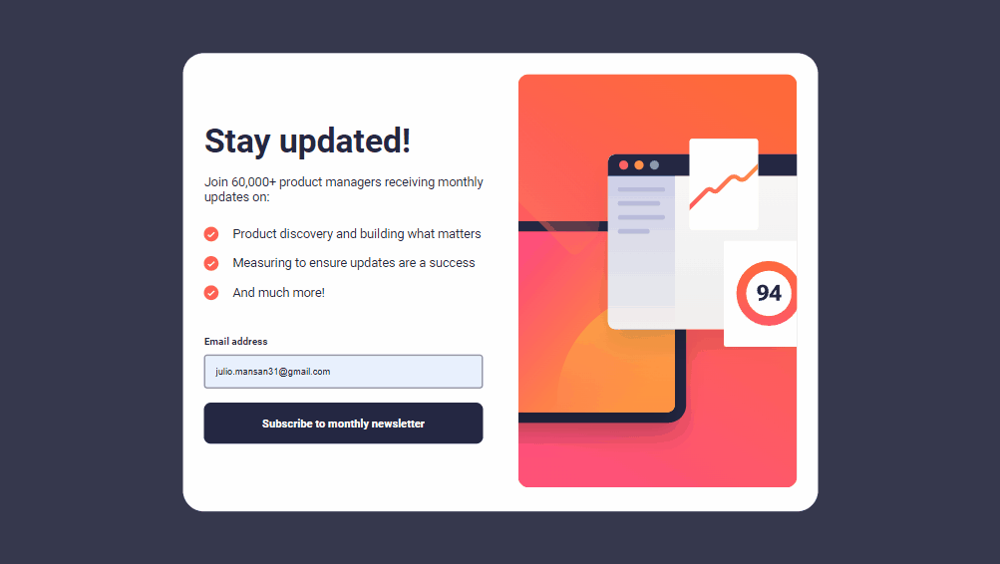
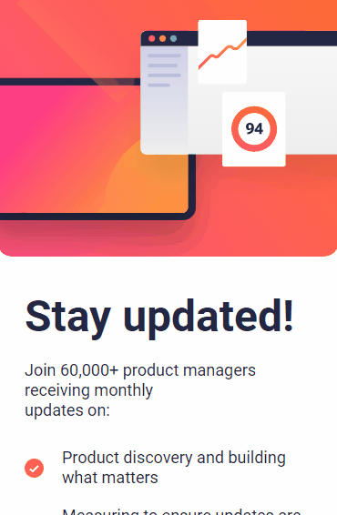

# Desafio Newsletter Sign Up - Frontend-Mentor

Este é um desafio de uma página de sign up, proposto pelo site Frontend-Mentor.

## Tabela de Conteúdos

- [Visão Geral](#visão-geral)
    - [Imagens](#imagens)
    - [Link da página](#link)
- [Processo](#processo)
    - [Linguagens utilizadas](#linguagens-utilizadas)
    - [O que aprendi](#o-que-aprendi)
    - [Possíveis evoluções](#possíveis-evoluções)
- [Autor](#autor)

## Visão-geral

### Imagens

<br>

````
Versão de Desktop
````

   

<br>

````
Versão Mobile
````

 

<br>

### Link

- Página no GitHub Pages: <a href="https://julio-mansan2.github.io/newsletter-sign-up/">Clique aqui!</a>

## Processo

### Linguagens utilizadas

<br>

- Marcações semânticas de HTML5
- Propriedades de customização do CSS3
- Estruturas de JavaScript

<br>

### O que aprendi

<br>

- Validar um campo input:


````javascript

const inputEmail = document.querySelector('#email')
const inputSubmit = document.querySelector('#sign-submit')
const error = document.querySelector('.error')
const thanksPage = document.querySelector('.thanks')
const signPage = document.querySelector('.sign')
const submit = document.querySelector('#submit')
const emailValue = document.querySelector('.email-value')
const btnThanks = document.querySelector('.btn-thanks')

inputSubmit.addEventListener('click', function() {
    event.preventDefault()
    if (inputEmail.validity.valid === false || inputEmail.value === '') {
        error.innerHTML = 'Insert a valid email'
        inputEmail.style.border = '2px solid hsl(4, 100%, 67%)'
    } else {
        signPage.classList.remove('selecionado')
        thanksPage.classList.add('selecionado')
        emailValue.innerHTML = inputEmail.value
    }
})

btnThanks.addEventListener('click', function () {
    signPage.classList.add('selecionado')
    thanksPage.classList.remove('selecionado')
})

````

<br>

### Possíveis evoluções

<br>

- Códigos compactos;
- Compreender de forma mais efetiva acerca da responsividade.

<br>

## Autor

GitHub - <a href="https://github.com/julio-mansan2">julio-mansan2</a> <br>
Front-end Mentor - <a href="https://www.frontendmentor.io/profile/julio-mansan2">julio-mansan2</a> <br>
LinkedIn - <a href="https://www.linkedin.com/in/j%C3%BAlio-a-mansan-3415a7249/">Júlio A.</a> <br>